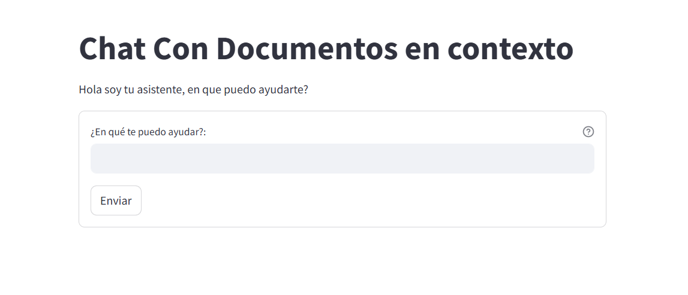

# Chat Con Documentos en Contexto



Sistema interactivo para consultas y respuestas basadas en documentos almacenados.

## Descripción

Este proyecto implementa un asistente virtual que utiliza tecnologías de procesamiento de lenguaje natural para permitir a los usuarios interactuar con un sistema que puede comprender y responder preguntas basadas en documentos almacenados. Utiliza la biblioteca Langchain y el almacenamiento persistente de Chroma para optimizar el procesamiento y la recuperación de información relevante de los documentos.

## Estructura del Proyecto

- `a_env_vars.py`: Contiene las variables de entorno necesarias para la configuración del proyecto.
- `config.py`: Configuraciones básicas como título y descripción del asistente.
- `core.py`: Gestiona la lógica central para el procesamiento de documentos y la generación de respuestas, incluyendo mejoras de manejo de errores y logging.
- `b_backend.py`: Conecta la lógica del asistente con la interfaz de usuario.
- `c_front_end.py`: Interfaz de usuario desarrollada con Streamlit para interactuar con el sistema.

## Dependencias

El proyecto depende de las siguientes bibliotecas:

- `streamlit`
- `langchain`
- `langchain_openai`
- `langchain_chroma`
- `os`
- `logging`

## Configuración

1. Clona el repositorio en tu máquina local.
2. Crea un entorno virtual e instala las dependencias necesarias:

```bash
python -m venv env
source env/bin/activate  # En Windows usa `env\Scriptsctivate`
pip install -r requirements.txt
```

3. Configura las variables de entorno en el archivo `a_env_vars.py` según tus necesidades:

```python
OPENAI_API_KEY = "tu_clave_api_aquí"
CHROMA_PATH = "./data/chroma"
```

## Uso

Para iniciar la interfaz del asistente y comenzar a interactuar con el sistema:

```bash
streamlit run c_front_end.py
```

El sistema permite realizar preguntas en lenguaje natural que son procesadas para recuperar y presentar respuestas basadas en los documentos disponibles.

## Ejemplo de Contenido

### a_env_vars.py

```python
OPENAI_API_KEY = "tu_clave_api_aquí"
CHROMA_PATH = "./data/chroma"
```

### core.py

```python
import logging
import os
from langchain_chroma import Chroma
from langchain_openai import OpenAIEmbeddings
import a_env_vars

# Configuración de OpenAI y Chroma
embedding_function = OpenAIEmbeddings(api_key=a_env_vars.OPENAI_API_KEY, model_name=a_env_vars.EMBEDDING_MODEL_NAME)
db = Chroma(persist_directory=a_env_vars.CHROMA_PATH, embedding_function=embedding_function)

def retrieve_document(query):
    return db.search(query)
```

## Contribuciones

Contribuciones al proyecto son bienvenidas

## Licencia
despues veremos
